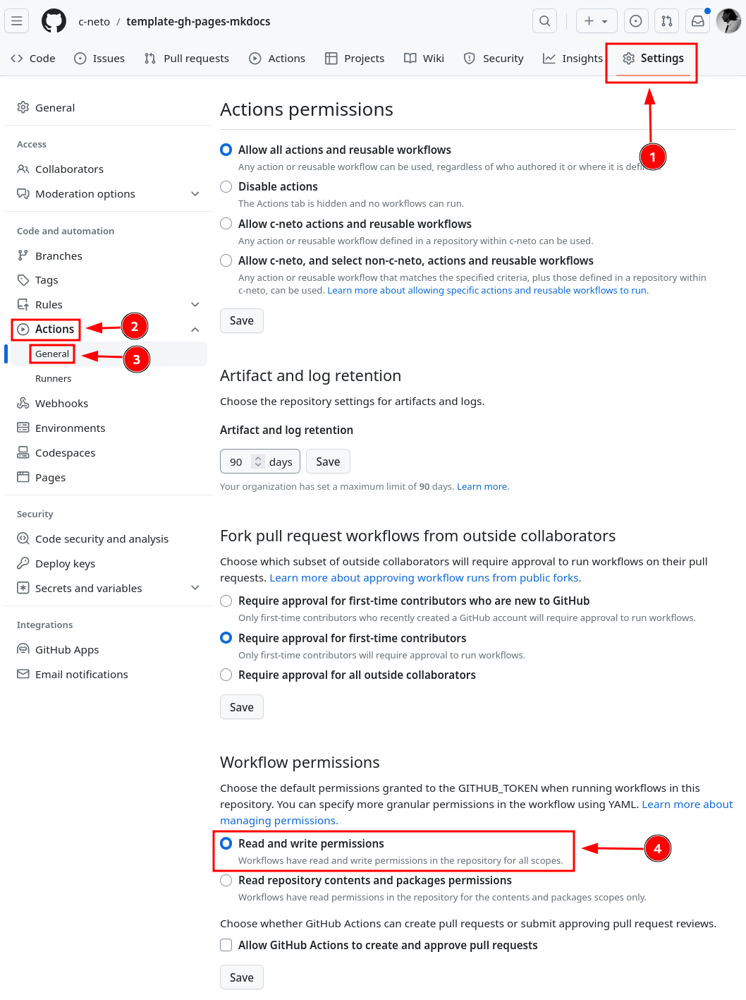
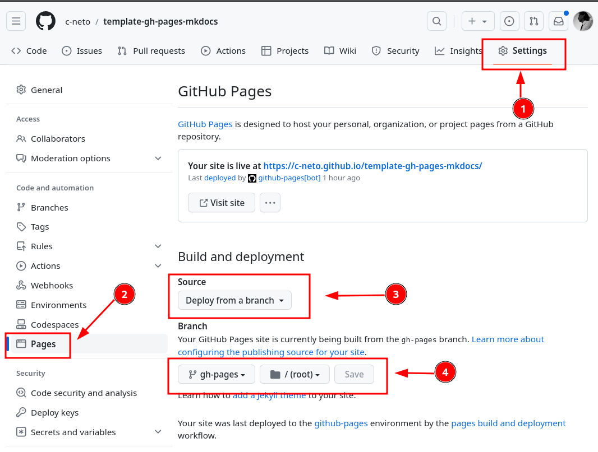

> [!WARNING]
> __DO NOT FORK THIS PROJECT!__
>
> This project is meant to be used from [Use this template](https://github.com/c-neto/template-gh-pages-mkdocs/generate) feature.

---

# template-gh-pages-mkdocs

Template repository for provisioning a document repository with the happiness combo: __MkDocs__ + __Github Actions__ + __GitHub Pages__.

Each commit on the `main` branch triggers a [GitHub Action Pipeline](/.github/workflows/deploy-contents-to-github-pages.yml) that transpiles Markdown files to modern web static files with [MkDocs](https://github.com/mkdocs/mkdocs) and provides them via GitHub Pages.

Check the web content that your page will reach when you use this template:
- https://c-neto.github.io/template-gh-pages-mkdocs/

## 📝 Project Structure Definition

The directory structure outlined below serves as the blueprint for organizing Markdown files, which are utilized in the configuration of the [mkdocs.yml](/mkdocs.yml) file to construct documentation comprising distinct sections and subsections.

```bash
├── docs                             # Directory containing Mkdocs content files 
│   ├── index.md                     # Main page of the site
│   ├── <SECTION>.md                 # Markdown files representing individual sections and subsections
│   └── img                          # Directory for image assets
│       └── <SECTION-NUMBER-PREFIX>-<IMAGE-NAME>.*   # Naming convention for images
├── Makefile                         # Script for setting up a local Mkdocs web server   
├── mkdocs.yml                       # Manifest file for MkDocs configuration
└── requirements.txt                 # File listing Python requirements necessary for installing MkDocs and its plugins
```

This structure ensures systematic organization of documentation files, facilitating easy navigation and maintenance. Additionally, it provides clarity on the purpose and location of each file within the project.

## ⚒️ Local Tests Setup

Use the [Makefile](/Makefile) shortcuts to install the MkDocs dependencies and provide local web server with hot reload feature.

```bash
$ make setup     # create python3 virtualenv and install requirements (MkDocs and MkDocs plugins)
$ make run       # run local web server with hot reload feature
```

> [!NOTE]
> If the commands above were run successfully, the web content will be accessible: http://127.0.0.1:8000/

## :gear: Repository Setup

### 1. Configure the `mkdocs.yml` Parameters

Replace all variables under `>>> REPLACE THE VALUE` in the [./mkdocs.yml](./mkdocs.yml) with values based on your repository properties (project URL, site name, author, etc).

### 2. Configure the GitHub Action Permissions

The [.github/workflows/deploy-contents-to-github-pages.yml](.github/workflows/deploy-contents-to-github-pages.yml) pipeline use the special variable `${{ secrets.GITHUB_TOKEN }}` to allow push action in the `gh-pages` branch. To achieve this, you need to configure the __Read Write__ permission in the Repository settings. This is necessary for the GitHub Action to create a branch and publish the built files. Check the following image for the configuration steps.

<table style="margin: 0 auto;"> <tr> <td style="text-align: center;">
  
</td> </tr> </table>

### 3. Enable GitHub Pages Feature

Now, it is necessary to configure GitHub Pages. The GitHub Action [.github/workflows/deploy-contents-to-github-pages.yml](.github/workflows/deploy-contents-to-github-pages.yml) pipeline creates a `gh-pages` branch with the static files transpiled by MkDocs. Thus, you need to configure GitHub Pages to use the `gh-pages` branch as a source to render the web files.

<table style="margin: 0 auto;"> <tr> <td style="text-align: center;">
  
</td> </tr> </table>

## :rocket: Done! But... Where is my GitHub Page Link?

If you have correctly configured your repo, the link will be available in the following pattern:

- `https://<GITHUB-USERNAME>.github.io/<GITHUB-REPO>/`

> [!NOTE]
> `<GITHUB-USERNAME>` and `<GITHUB-REPO>` are placeholders. Replace with your properties.
