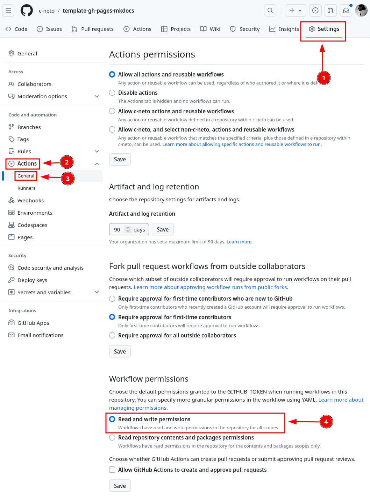
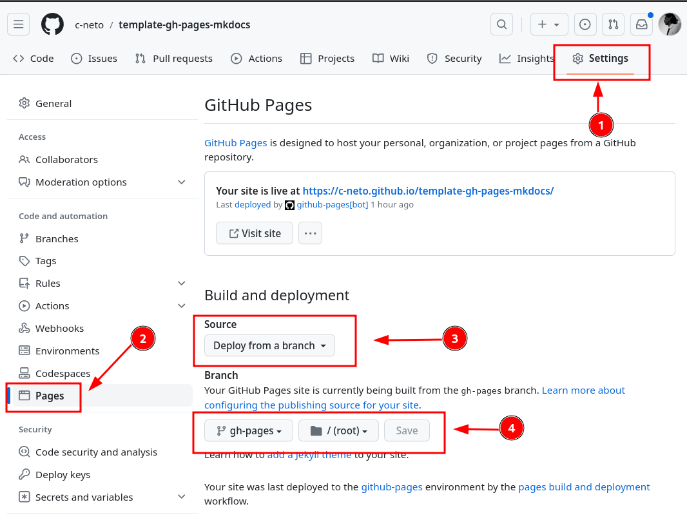

# template-gh-pages-mkdocs

Template repository to make a web page with: Mkdocs + GitHub Pages.

The content is written in the Markdown file format. Each commit and push on `main` branch trigger a _GitHub Action_ that transpile Markdown files to modern web static files with MkDocs and provides via Github Pages.

Check the web content that you page will reach when you use this template: 
- https://c-neto.github.io/template-gh-pages-mkdocs/

## Directory Structure

Project directories structure pattern:

```shell
.
├── docs                             # parente directory of the contents files 
│   ├── index.md                     # first site page
|   ├── <SECTION>.md                 # files separate by subsections according
│   └── img                          # image assets directories
│       └── <SECTION-NUMBER-PREFIX>-<IMAGE-NAME>.*  
├── Makefile                         # scripts to create local mkdocs web server   
├── mkdocs.yml                       # MkDocs manifest file
└── requirements.txt                 # python requirements file to install MkDocs and MkDocs Plugins
```

MkDocs provides local hot reload transpile Markdown files feature. For to configure this feature, install `make` and `python3-virtualenv` and run:

```bash
$ git clone https://github.com/augustoliks/aws-mini-book
$ cd aws-mini-book/
$ make venv       # create python3 virtualenv and install requirements (MkDocs and MkDocs plugins)
$ make serve      # run local web server with hot reload feature
```

If the commands above were run with successful, the web content will be accessible: http://127.0.0.1:8000/

## Manual Configurations

### 1. Replace the `mkdocs.yml`

Replace the all variables that had `>>> REPLACE THE VALUE` in the [./mkdocs.yml](./mkdocs.yml) with values based on your repo.

### 2. Configure the GitHub Action permissions

The [/.github/workflows/deploy-contents-to-github-pages.yml](.github/workflows/deploy-contents-to-github-pages.yml) use the `${{ secrets.GITHUB_TOKEN }}` variable to perform the push of the `gh-pages` branch. For this, it is necessary configure the Read Write permission for GitHub action. Check the following print to configure it.



---

### 3. Enable GitHub Pages Feature

Now, it is necessary configure the GitHub Pages. The GitHub Action [/.github/workflows/deploy-contents-to-github-pages.yml](.github/workflows/deploy-contents-to-github-pages.yml) create a `gh-pages` branch with the static file of the Mkdocs transpilation. Thus, you must configure the GitHub Pages to use the branch `gh-pages` as a source to render the web files.





## Where is my GitHub Page Link?

If you correctly configured your repo, the link will be able in the following pattern:

- `https://<MY-GITHUB-USERNAME>.github.io/<MY-GITHUB-REPO>/`

> Replace `<MY-GITHUB-USERNAME>` and `<MY-GITHUB-REPO>` based on needs.
